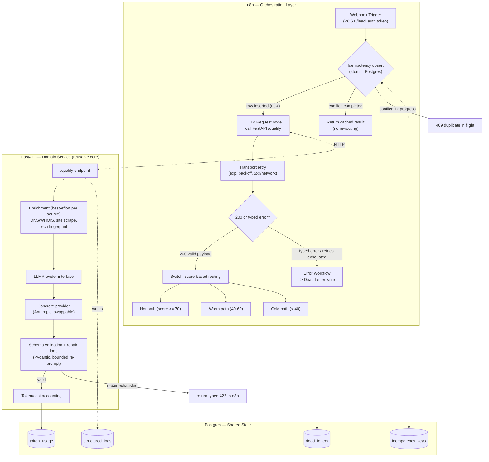

# Lead Qualification Agent — Architecture

> Status: draft for review. No code written yet. This document is the contract for the build.

## 1. Purpose and demo effect

Input: a company domain (e.g. `acme.com`). Nothing else.
Output: an enriched company profile, a lead score, a drafted outreach message, and a routing decision (hot / warm / cold) — with full traceability of how it got there.

The point of this piece is not the LLM call. It's the orchestration discipline around it: idempotency, retries, schema-validated output, dead-lettering, structured logs, and cost tracking, all visible and inspectable by a technical reviewer. n8n is the visible skeleton; the FastAPI service is where the actual engineering lives.

## 2. Component boundary — what lives where

**Hard boundary**: n8n never touches enrichment logic, prompts, or scoring. It only (1) deduplicates, (2) calls one HTTP endpoint, (3) retries transport-level failures, (4) routes on a `score` field it receives back, (5) dead-letters on exhaustion. FastAPI owns everything domain-specific: enrichment, LLM call, schema validation of the LLM's own output, and cost accounting.

This boundary is what makes the core reusable in the eval-harness piece and in the internal pipeline: it's a plain HTTP service with a stable contract, importable as a library too if needed — n8n is a replaceable caller, not a dependency of the domain logic.

## 3. Data flow (happy path)

1. `POST /lead {"domain": "acme.com", "idempotency_key": "<optional>"}` hits the n8n webhook, carrying an auth token header (§4.7).
2. n8n performs a single **atomic** upsert into `idempotency_keys` (`INSERT ... ON CONFLICT (key) DO NOTHING RETURNING status`) — see §4.1 for why this is one statement, not check-then-insert:
   - **Row inserted** (new key): proceed to step 3.
   - **Conflict, existing status `completed`**: return the cached `result` immediately. Crucially, this path **does not re-enter routing** — no duplicate hot-path side effects, no duplicate LLM spend.
   - **Conflict, existing status `in_progress`**: return `409` (duplicate in flight).
   - **Conflict, existing status `failed`**: treated as new — reset row to `in_progress` and proceed (a prior failure should be retryable).
3. n8n calls `POST /qualify {"domain": ...}` on FastAPI (synchronous request; see §4.8 for the latency/timeout decision).
4. FastAPI runs enrichment (DNS/WHOIS, site scrape, tech fingerprint) concurrently, **best-effort per source** (§4.9): each source that fails is recorded as absent in the profile rather than failing the whole request. A request only fails enrichment if *zero* sources produced usable data.
5. FastAPI calls the LLM through the `LLMProvider` interface with the assembled profile, asking for `{score, reasoning, draft_message, confidence}`. The profile explicitly tells the model which fields are missing, so a thin profile yields a low-confidence score rather than a hallucinated one.
6. FastAPI validates the LLM's JSON output against a Pydantic schema. On failure, it runs the bounded schema-repair loop (§4.2); on repeated failure it returns a typed `422` to n8n instead of malformed data.
7. FastAPI logs structured events (§4.5) and writes token usage/cost to `token_usage` (§4.6).
8. n8n receives a `200` with a valid payload, marks the idempotency row `completed` (storing the result), and routes by score.
9. Any `4xx/5xx` typed error from FastAPI, or exhaustion of the transport retry, triggers the n8n Error Workflow, which writes a full snapshot (input, failure stage, last error, attempt count, timestamp) to `dead_letters` and marks the idempotency row `failed`.

## 4. Robustness mechanisms

### 4.1 Idempotency
- **Lives in**: Postgres, checked/written from n8n at the workflow boundary (not inside FastAPI — FastAPI stays stateless per request).
- **Mechanism**: `idempotency_keys(key PK, domain, status[in_progress|completed|failed], result JSONB, created_at, updated_at)`. Key is either client-supplied in the webhook payload or derived as `hash(domain + date-bucket)` if the caller doesn't supply one, so accidental duplicate submissions of the same domain within a window collapse naturally.
- **Race-safe by construction**: acquisition is a *single* statement — `INSERT INTO idempotency_keys (key, domain, status) VALUES (..., 'in_progress') ON CONFLICT (key) DO NOTHING RETURNING status`. If a row comes back, this caller won the insert and owns the work; if nothing comes back, a concurrent caller already holds the key and we branch on its current status. Check-then-insert (two statements) would let two concurrent identical submissions both pass the check and both run — this is the exact race the atomic upsert closes, and the kind of detail a technical reviewer looks for.
- **Terminal-state semantics**: a `completed` key returns the stored result and **skips routing entirely** — re-submitting a lead must never re-fire the hot-path side effect. A `failed` key is retryable (reset to `in_progress`); a `completed` key is not.
- **Why n8n-side, not FastAPI-side**: idempotency is an orchestration concern (did we already run this workflow?), not a domain concern (FastAPI shouldn't need to know about client retry semantics). Keeps FastAPI a pure function of its input.

### 4.2 Retry with backoff
- **Two layers, deliberately different**:
  - **n8n → FastAPI (transport-level)**: n8n's HTTP Request node retry config — exponential backoff (e.g. 3 attempts, base 2s, factor 2x) for network errors / 5xx. This handles "the service hiccuped."
  - **FastAPI → LLM (schema-repair-level)**: a small internal retry loop (e.g. max 2 retries) specifically for schema-invalid LLM output, re-prompting with the validation error appended. This handles "the model returned garbage," which is a different failure mode from a network error and shouldn't be conflated with it.
- **Why separate**: a network retry re-sends the identical request; a schema-repair retry changes the prompt. Merging them into one retry policy would either waste attempts resending an identical bad prompt, or leak domain logic into n8n.

### 4.3 Schema validation of LLM output
- **Lives in**: FastAPI, using Pydantic models as the single source of truth, exported as JSON Schema for documentation/testing.
- **Mechanism**: LLM is prompted for strict JSON; response is parsed and validated against `LeadQualification(score: int 0-100, reasoning: str, draft_message: str, confidence: float)`. Invalid output never reaches n8n — it's either repaired (§4.2) or surfaced as a typed error (`SchemaValidationError`) that n8n treats as a failure to dead-letter.
- **Why here, not in n8n**: n8n has no first-class JSON Schema validation against a Pydantic-defined contract; doing it in FastAPI means the same validation logic is reused by the future eval harness (it can replay dead-lettered inputs against the same schema).

### 4.4 Dead-letter queue
- **Lives in**: Postgres `dead_letters` table, written by an n8n Error Workflow (triggered by any unhandled failure in the main workflow).
- **Schema**: `id, domain, idempotency_key, failure_stage[enrichment|llm|schema|network], last_error, attempt_count, payload_snapshot JSONB, created_at`.
- **Why Postgres over a message-queue DLQ**: at this workflow's volume, a queryable table beats a queue for the portfolio's purpose — a reviewer (or you, live) can run `SELECT * FROM dead_letters WHERE failure_stage='schema'` and see exactly what broke. A requeue/reprocess script becomes a 10-line follow-up feature, not a new piece of infra.

### 4.5 Structured logging
- **Lives in**: FastAPI emits structured JSON logs (one line per request stage: `enrichment_started`, `llm_called`, `schema_validated`, `request_completed`) tagged with a `trace_id` = the idempotency key, so a single lead's full journey is greppable/queryable across both n8n execution logs and FastAPI logs by the same ID.
- **Also persisted to**: `structured_logs` table in Postgres (not just stdout) so the demo can show a SQL query answering "show me everything that happened for domain X" — this is the detail a technical buyer notices.

### 4.6 Token/cost tracking
- **Lives in**: FastAPI, immediately after each LLM call, using the provider's returned usage metadata (input/output tokens) multiplied by a configurable per-model cost table.
- **Persisted to**: `token_usage(idempotency_key, model, input_tokens, output_tokens, cost_usd, created_at)`.
- **Demo value**: a `/stats` endpoint or a small dashboard query showing running cost-per-lead and total spend — this is the detail that signals "this person thinks about unit economics," not just "this person can call an LLM API."

### 4.7 Webhook authentication and abuse ceiling
- **Problem**: a public webhook that triggers LLM spend is an abuse vector — left open, anyone can hammer it and run up cost. A portfolio piece that ignores this reads as naïve to exactly the buyer it targets.
- **Mechanism (three cheap layers)**:
  1. **Shared-secret token**: the webhook requires an `X-Auth-Token` header matching an env var; missing/wrong → `401` before any work. Documented in the README so a reviewer can still try the demo.
  2. **Rate limit**: per-token (or per-IP for the open demo) request cap over a window, enforced at the n8n edge, returning `429` when exceeded.
  3. **Global daily cost ceiling**: a cheap `SELECT SUM(cost_usd) FROM token_usage WHERE created_at > now() - interval '1 day'` gate before the LLM call; over budget → `503` with a clear message. This bounds worst-case spend even if auth and rate limit are both bypassed, and doubles as a visible unit-economics guardrail in the demo.
- **Why it matters for the piece**: the cost ceiling in particular converts "I track cost" (§4.6) into "I act on cost" — a stronger signal at almost no extra build cost.

### 4.8 Synchronous vs asynchronous processing
- **Decision**: **synchronous** `/qualify` for this piece. Enrichment + one LLM call realistically completes within a webhook's timeout budget, and a synchronous request keeps the demo legible — one request in, one enriched decision out, no polling.
- **Guardrails**: FastAPI enforces per-stage timeouts (enrichment and LLM each bounded) so total latency stays inside n8n's HTTP node timeout; the n8n node timeout is set explicitly above the sum of those budgets, not left at default.
- **Documented escape hatch**: if a future higher-volume use (internal pipeline) needs it, the same endpoint can move behind a `202 Accepted` + callback/poll pattern without touching the domain logic — noted so the reviewer sees the choice was deliberate, not an oversight. We do not build the async path now (would be over-engineering for the demo).

### 4.9 Partial-enrichment semantics
- **Rule**: each enrichment source (DNS/WHOIS, scrape, tech fingerprint) runs independently and is *best-effort*. A failed or empty source is recorded as `null`/absent in `CompanyProfile` with a `sources_ok`/`sources_failed` manifest — it does **not** fail the request.
- **Hard failure only when**: zero sources produced usable data (e.g. domain doesn't resolve at all) → typed `422`, dead-lettered with `failure_stage=enrichment`.
- **Why**: WHOIS especially is flaky in the free tier (rate limits, redacted TLDs, inconsistent formats). Letting one flaky source sink an otherwise-good lead would make the demo look fragile. The `confidence` field in the output reflects how complete the profile was, so the LLM's certainty is honestly tied to input quality.

## 5. Stack decisions (confirmed)

| Decision | Choice | Rationale |
|---|---|---|
| **(a) Enrichment sources** | Free-only: DNS/WHOIS lookup, site scrape (title/meta/visible text), tech fingerprint via HTTP headers + HTML patterns (lightweight Wappalyzer-style rules) | Zero paid API dependency — anyone can `docker compose up` and get the full effect with no keys except the LLM provider's. Protects reproducibility, the stated quality signal. |
| **(b) Idempotency + DLQ store** | Postgres | One piece of infra serves idempotency, dead-letter, structured logs, and cost tracking. Reads as a deliberately-designed audit trail to a technical reviewer, not an over-engineered extra moving part (which Redis would be, for this scale, with the added downside of losing DLQ data to TTL). |
| **(c) LLM location** | Inside FastAPI, behind an `LLMProvider` interface | Keeps n8n as pure orchestration/routing. Makes the domain service (enrichment + scoring + draft) a standalone, reusable, testable unit — required for reuse in the eval-harness piece and the internal pipeline without rebuilding. |
| **(d) Deploy target** | Self-contained `docker-compose.yml` (n8n + FastAPI + Postgres), repo is `git clone && docker compose up` | Strongest reproducibility signal for a technical buyer: they can inspect and run the whole thing locally, not just trust a hosted demo. A live instance on your Coolify VPS can still exist as a clickable demo, running the exact same compose stack — not a separate deploy story. |
| **(e) LLM provider** | Thin provider-agnostic interface (`LLMProvider` protocol with `.score_and_draft()`), one concrete implementation (Anthropic) wired in | Near-zero extra build cost, meaningful engineering signal (vendor lock-in awareness, mockable in tests) — without the over-engineering of actually implementing multiple providers nobody asked for. |

## 6. Reusability contract (for the eval-harness piece and internal pipeline)

- The FastAPI service is the reusable unit. It is published/structured so it can be:
  - run standalone (its own compose file / `pip install`-able package), independent of n8n;
  - imported as a library (`from lead_enrichment import enrich_domain, LeadQualification`) by an eval harness that replays a fixed set of domains against the scoring logic and measures score stability/drift;
  - reused by the internal pipeline by pointing at the same package, with pipeline-specific config (different paid enrichment sources, different LLM provider, different prompts) injected via environment/config, never forked into a copy.
- **What stays generic in the public repo**: enrichment interfaces, the `LLMProvider` protocol, the Pydantic schemas, the FastAPI app, the n8n workflow JSON, docker-compose.
- **What never enters the public repo**: any PT-SME-specific config, prompts, paid API keys, or business rules — those live in a private config layer that the internal pipeline supplies separately, consuming the same package as a dependency.

## 7. Build plan (phases)

**Phase 0 — Contracts first**
- Define Pydantic schemas (`CompanyProfile`, `LeadQualification`) and the `LLMProvider` protocol.
- Define the Postgres schema (idempotency_keys, dead_letters, structured_logs, token_usage) as a migration.
- No enrichment logic yet — stub it. Goal: the shape of every payload is locked before any implementation.

**Phase 1 — FastAPI domain service, enrichment only**
- Implement DNS/WHOIS, site scrape, tech fingerprint modules.
- `/enrich` endpoint returns a `CompanyProfile` for a domain, no LLM yet.
- Unit tests against a handful of real domains (recorded/fixtured responses, so tests don't depend on live network).

**Phase 2 — LLM scoring + schema validation**
- Implement `LLMProvider` + Anthropic concrete provider.
- `/qualify` endpoint: enrichment → LLM → schema-validated `LeadQualification`.
- Schema-repair retry loop (§4.2).
- Cost tracking write-through.

**Phase 3 — n8n orchestration**
- Webhook, idempotency check/write, HTTP call to `/qualify`, transport retry/backoff, score-based Switch routing.
- Error Workflow wired to dead-letter write.

**Phase 4 — Observability polish**
- Structured logs with `trace_id` correlation across both systems.
- A minimal `/stats` view or query set for cost/latency/failure-rate, screenshot-able for the portfolio writeup.

**Phase 5 — Packaging for reproducibility**
- `docker-compose.yml` bringing up all three services with sane defaults, `.env.example`, a README with a "clone and run in under 5 minutes" path and one example domain to try.
- Verify on a clean machine/VM before publishing.

## 8. Defaults locked for the build (were open items)

You couldn't review live, so I made the reasonable call on the three open items — each is config, so cheap to change later:

- **Routing thresholds**: `hot >= 70`, `warm 40–69`, `cold < 40`. Held in one config constant, not hardcoded in the Switch node, so a reviewer sees a single tunable band.
- **Default LLM model**: **Claude Haiku 4.5** as the default. Rationale: scoring + a short draft is a cheap, high-volume task; a small fast model keeps cost-per-lead low, which *reinforces* the unit-economics story (§4.6) rather than undercutting it. The provider-agnostic interface (§5e) means swapping to a larger model is a one-line config change if a reviewer wants to see it.
- **Hot-path action**: **no-op stub by default**, with an *optional* real action (Slack/webhook) that activates only if `HOT_PATH_WEBHOOK_URL` is set — the same graceful-degradation pattern as enrichment. Keeps the public demo dependency-free (nobody needs a Slack workspace to run it) while showing the extension point is real, not hypothetical.

If you want any of these changed, they're isolated to config and the Switch node — no architectural rework.

---

*This document was self-reviewed after drafting: fixed a diagram/text contradiction on retry layering, closed an idempotency race (check-then-insert → atomic upsert), stopped duplicate submissions from re-firing side effects, and added webhook auth + cost ceiling, sync/async rationale, and partial-enrichment semantics. Ready to start Phase 0 on your go.*
